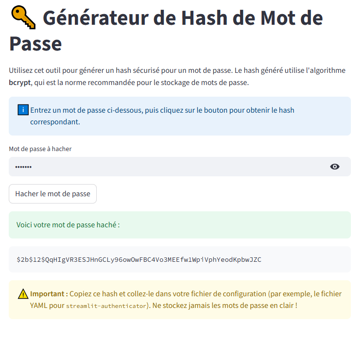

# Application de Hachage avec Streamlit

Cette application web, construite avec Streamlit, permet de calculer le hachage de textes ou de fichiers en utilisant une variété d'algorithmes de hachage.

[](https://votre-lien-vers-l-app-streamlit.streamlit.app) <-- *Pensez à mettre à jour ce lien !*

## Description

L'outil offre une interface simple pour :
- Saisir ou coller un texte.
- Uploader un fichier.
- Sélectionner un algorithme de hachage parmi une liste (par exemple, SHA-256, SHA-512, MD5).
- Afficher le digest (la valeur de hachage) résultant en temps réel.

C'est un excellent moyen de vérifier l'intégrité d'un fichier ou de calculer rapidement une empreinte de données.

*(N'hésitez pas à ajouter une capture d'écran de votre application ici)*


## Comment lancer le projet localement

Suivez ces étapes pour exécuter l'application sur votre machine.

1.  **Clonez le dépôt :**
    ```bash
    git clone https://github.com/votre-nom-utilisateur/votre-repo.git
    cd votre-repo
    ```

2.  **Créez un environnement virtuel et activez-le :**
    ```bash
    # Pour Windows
    python -m venv venv
    .\venv\Scripts\activate

    # Pour macOS/Linux
    python3 -m venv venv
    source venv/bin/activate
    ```

3.  **Installez les dépendances :**
    Le fichier `requirements.txt` est fourni pour faciliter cette étape.
    ```bash
    pip install -r requirements.txt
    ```

4.  **Lancez l'application Streamlit :**
    ```bash
    streamlit run streamlit_hasher/app.py
    ```
    Votre navigateur devrait s'ouvrir automatiquement sur l'adresse de l'application (généralement `http://localhost:8501`).

## Déploiement sur Streamlit Community Cloud

Pour déployer votre application, assurez-vous que :
1.  Votre projet est sur un dépôt GitHub public.
2.  Le fichier `requirements.txt` est à la racine de votre dépôt.
3.  Votre script principal (`app.py`) est bien localisé.

Ensuite :
1.  Allez sur [share.streamlit.io](https://share.streamlit.io).
2.  Cliquez sur "Deploy an app" et connectez votre compte GitHub.
3.  Sélectionnez le bon dépôt, la bonne branche, et spécifiez le chemin vers votre fichier principal : `streamlit_hasher/app.py`.
4.  Cliquez sur "Deploy!".

## Technologies utilisées

-   **Python 3**
-   **Streamlit** - Le framework principal pour l'interface web.
-   **hashlib** - La bibliothèque Python native pour les calculs de hachage.
